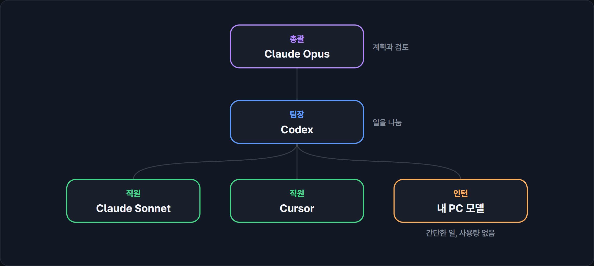
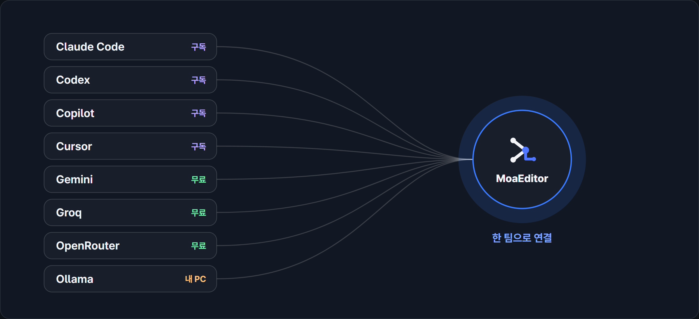
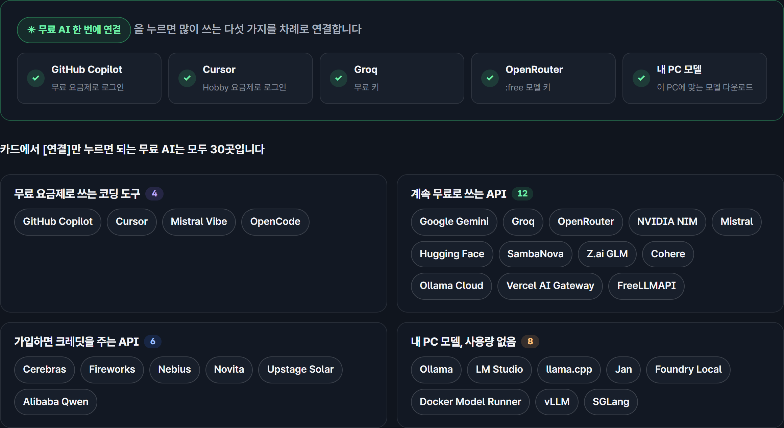

<h1 align="center">MoaEditor</h1>

여러 AI를 총괄, 팀장, 직원, 인턴으로 나눠 일을 맡기는 코드 에디터

  <a href="https://moaeditor.dev">홈페이지</a> ·
  <a href="https://moaeditor.dev/download/">다운로드</a> ·
  <a href="docs/free-ai/README.md">무료 AI 30곳</a> ·
  <a href="https://github.com/moaeditor/moaeditor/issues/new/choose">버그와 의견</a>

<a href="README.md">English</a> · <b>한국어</b> · <a href="README.zh-CN.md">简体中文</a>

## 기능

### AI 조직도

- 총괄은 계획과 검토, 팀장은 일 나누기, 직원은 구현, 인턴은 내 PC 모델로 단순한 일을 맡습니다.
- 이름, 팀, 직급, 역할은 표에서 바꿉니다.
- 막힌 일은 힌트, 다른 AI, 상급자, 한 단계 위 순서로 넘어갑니다.
- 무엇을 만들지 한 줄 적으면 AI가 자리마다 모델을 정하고 AGENTS.md, CLAUDE.md, .gitignore를 만듭니다.

### 지시와 결재

- 홈에 할 일을 적으면 총괄이 계획을 보여 줍니다. [승인하고 실행]으로 한 번에 맡기거나 [단계마다 결재]로 하나씩 확인합니다.
- 허가 방식은 계획만, 모두 물어보기, 중요한 것만 물어보기, 자동 가운데 고릅니다.
- 끝나면 바뀐 파일과 걸린 시간이 나옵니다. 파일마다 되돌리거나, 실행 전으로 되돌리거나, 커밋합니다.

### 한도와 사용량

- 한 AI가 한도에 닿거나 막히면 연결된 다른 AI가 이어받습니다. 누가 이어받을지는 모델마다 최근 7일 기록을 보고 정합니다.
- 사용량이 80%쯤 되면 알려 줍니다.
- 비싼 모델은 계획과 검토만 하고, 구현은 더 싼 모델이나 무료 API, 단순한 일은 내 PC 모델이 합니다. 계산해 보면 비싼 모델 비용이 최대 85% 줄어듭니다.1
- 모델과 생각 수준은 자리마다 정하거나 자동으로 둡니다.
- [Claude Code 한도가 찼을 때 할 수 있는 것](https://moaeditor.dev/guides/claude-code-limit/)

### 보조 AI

- 고치지 않고 고쳤다는 보고, 위험한 명령, 누구에게 맡길지 같은 작은 판단을 따로 작은 모델이 봅니다.
- 메모리 8GB 이상 NVIDIA 그래픽카드가 있으면 내 PC에서 돌고, 없으면 모아에디터가 제공하는 것(로그인하면 하루 2,000회)이나 내 Cloudflare 토큰을 씁니다. 끌 수 있습니다.

### 연결

- 구독 도구 13개: Claude Code, Codex, GitHub Copilot, Cursor, Gemini CLI, OpenCode, Kimi Code, Qwen Code, goose, Augment, Mistral Vibe, Factory Droid, Cline
- API 키: OpenAI, Anthropic, Google Gemini, Groq, OpenRouter, 회사 클라우드, 국내 모델 등
- 내 PC 모델: Ollama, LM Studio, llama.cpp, Jan, Foundry Local, Docker Model Runner, vLLM, SGLang
- [한 번에 연결]을 누르면 이 PC에 있는 AI를 차례로 설치하고 로그인하고 확인합니다.

### 무료 AI

- [무료 AI 한 번에 연결]은 Copilot과 Cursor의 무료 요금제, Groq와 OpenRouter의 무료 키, 내 PC 모델을 연결합니다.
- 무료로 쓸 수 있는 곳 30곳은 [목록](docs/free-ai/README.md)에 있습니다.

### 회사, 학교, 공공기관

- 회사 요금제 구독(Team, Business, Enterprise), 회사 클라우드 API, 사내 GPU 서버를 연결합니다.
- 폐쇄망에서는 라이선스 파일로 로그인 없이 씁니다.
- 문의: [기업·학교·공공 안내](https://moaeditor.dev/enterprise/), admin@moaeditor.dev

## 설치

[다운로드 페이지](https://moaeditor.dev/download/)에서 받으세요. Windows 10, 11용입니다.

아직 코드 서명 전이라 Windows 경고가 뜰 수 있습니다.

## 요금

개인, 학생, 교육 기관, 비영리 기관, 직원 50명 미만 회사는 무료입니다. 연결한 AI 요금은 각 회사에 냅니다. [요금 안내](https://moaeditor.dev/pricing/)

## 개인정보

API 키는 이 PC의 보안 저장소에 두고, 코드와 지시는 고른 AI 회사로 바로 보냅니다. [개인정보 처리방침](https://moaeditor.dev/legal/privacy/), [이용약관](https://moaeditor.dev/legal/terms/)

## 버그와 의견

[이슈](https://github.com/moaeditor/moaeditor/issues/new/choose)로 남겨 주세요. 보안 문제는 admin@moaeditor.dev로 보내 주세요.

## 이 저장소

소개와 이슈를 받는 저장소이고 소스 코드는 없습니다. 모아에디터는 Code - OSS(MIT)를 바탕으로 만들었고 Microsoft와 관련이 없습니다.

---

1. 계획과 검토를 일의 15%로 보고, 모든 일을 Claude Opus 5.5로 할 때와 [Anthropic 공식 요금](https://platform.claude.com/docs/en/about-claude/pricing)(2026-10-06)으로 비교한 값입니다. 실제로는 작업마다 다르고, 여러 AI가 함께 일해서 전체 토큰은 늘 수 있습니다. 비슷한 방식을 다룬 [RouteLLM](https://github.com/lm-sys/RouteLLM)은 MT Bench에서 GPT-4 성능의 95%를 유지하며 비용을 최대 85% 줄였습니다.

© 2026 주식회사 호라이즌 (Horizon Co., Ltd.)
