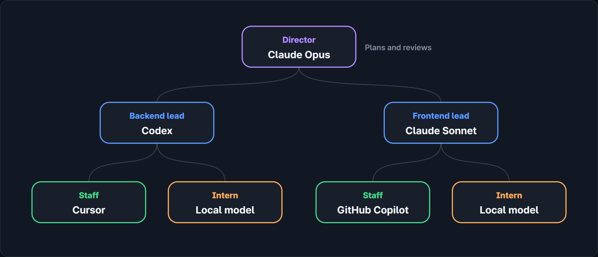
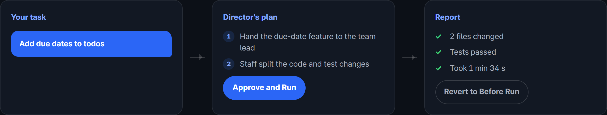
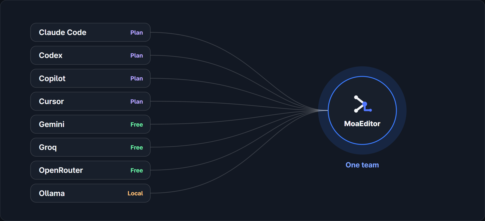
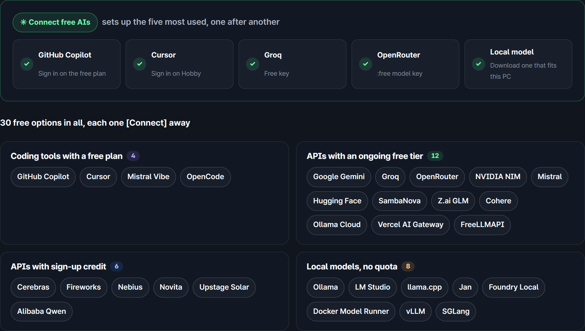

<h1 align="center">MoaEditor</h1>

A code editor that puts your AIs in an org chart (director, team leads, staff, interns) and splits the work between them

  <a href="https://moaeditor.dev/en/">Website</a> ·
  <a href="https://moaeditor.dev/en/download/">Download</a> ·
  <a href="docs/free-ai/README.en.md">30 free AIs</a> ·
  <a href="https://github.com/moaeditor/moaeditor/issues/new/choose">Bugs and ideas</a>

<b>English</b> · <a href="README.ko.md">한국어</a> · <a href="README.zh-CN.md">简体中文</a>

## Features

### AI org chart

- The director plans and reviews, team leads split the work, staff write the code, and interns run simple jobs on a local model.
- Names, teams, ranks and roles are edited in a table.
- Blocked work moves up: a hint, another AI, the manager, then one level up.
- Describe the project in one line and an AI picks a model for each seat and writes AGENTS.md, CLAUDE.md and .gitignore.

### Tasks and approval

- Write a task in Home and the director shows a plan. Approve and Run hands it all off; Approve Each Step goes one step at a time.
- Permission modes: Plan only, Ask for everything, Ask only for important things, Auto.
- At the end you see the changed files and time taken. Revert a file, revert the whole run, or commit.

### Limits and usage

- When an AI hits its limit or gets stuck, another connected AI takes over, chosen from each model’s last 7 days of results.
- A notice shows at about 80% usage.
- Expensive models only plan and review; cheaper models or free APIs write the code and local models do simple jobs. By our calculation that cuts the expensive-model bill by up to 85%.1
- Model and thinking level can be set per seat or left on auto.
- [What to do when Claude Code hits its limit](https://moaeditor.dev/en/guides/claude-code-limit/)

### Helper AI

- A separate small model checks claimed fixes that weren’t made, risky commands, and small calls like who gets a task.
- It runs on your PC with an NVIDIA GPU with 8 GB or more; otherwise it uses the one MoaEditor provides (2,000 checks a day when signed in) or your Cloudflare token. It can be turned off.

### Connections

- 13 subscription tools: Claude Code, Codex, GitHub Copilot, Cursor, Gemini CLI, OpenCode, Kimi Code, Qwen Code, goose, Augment, Mistral Vibe, Factory Droid, Cline
- API keys: OpenAI, Anthropic, Google Gemini, Groq, OpenRouter, company clouds, Korean models and more
- Local models: Ollama, LM Studio, llama.cpp, Jan, Foundry Local, Docker Model Runner, vLLM, SGLang
- Connect all installs, signs in and checks the AIs on your PC one by one.

### Free AIs

- Connect free AIs sets up the free plans of Copilot and Cursor, free Groq and OpenRouter keys, and a local model.
- All 30 free options are in [the list](docs/free-ai/README.en.md).

### Companies, schools, public sector

- Company plan subscriptions (Team, Business, Enterprise), company cloud APIs and in-house GPU servers.
- On offline networks, a license file replaces sign-in.
- Contact: [Business, schools and public sector](https://moaeditor.dev/en/enterprise/), admin@moaeditor.dev

## Install

Get it from the [download page](https://moaeditor.dev/en/download/). Windows 10 and 11. The app UI is in English and Korean.

The installer isn’t code-signed yet, so Windows may show a warning.

## Pricing

Free for individuals, students, schools, nonprofits and companies with fewer than 50 employees. You pay each AI provider as usual. [Pricing](https://moaeditor.dev/en/pricing/)

## Privacy

API keys are kept in your PC’s secure storage, and code and instructions go straight to the AI provider you picked. [Privacy Policy](https://moaeditor.dev/en/legal/privacy/), [Terms](https://moaeditor.dev/en/legal/terms/)

## Bugs and ideas

Open an [issue](https://github.com/moaeditor/moaeditor/issues/new/choose). Send security issues to admin@moaeditor.dev.

## About this repository

This repository is for the overview and issues; the source code isn’t here. MoaEditor is built on Code - OSS (MIT) and isn’t affiliated with Microsoft.

---

1. Planning and review taken as 15% of the work, compared with doing everything on Claude Opus 5.5 at [Anthropic’s official prices](https://platform.claude.com/docs/en/about-claude/pricing) (2026-10-06). Real results vary by task, and total tokens can go up because several AIs work together. [RouteLLM](https://github.com/lm-sys/RouteLLM), a study of a similar approach, cut costs by up to 85% while keeping 95% of GPT-4’s performance on MT Bench.

© 2026 Horizon Co., Ltd.
